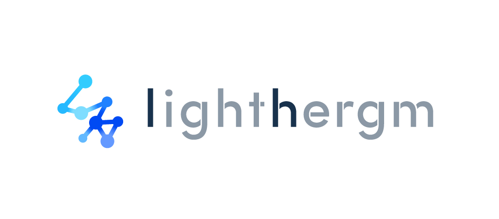

# `lighthergm`: Fit, Simulate, and Diagnose Hierarchical Exponential-Family Models for Networks in A Scalable Way

`lighthergm` is an R library for estimating Hierarchical Exponential Random Graph Models (HERGMs) efficiently on large networks. It also contains tools for simulating networks with local dependence and for assessing the goodness-of-fit of the estimates. It is built upon the existing R package `hergm` (Schweinberger and Luna, 2018).

See [Martínez Dahbura et al. (2021)](https://arxiv.org/abs/2105.12704) for more details on the algorithm and the model.

## Table of Contents

- [Installation](#installation)
- [Usage](#usage)
- [Docker](#docker)
- [Contributing](#contributing)
- [License](#license)
- [References](#references)

## Installation

You can install `lighthergm` in several ways.


### From GitHub

Use devtools to install directly from the repository:
```r
devtools::install_github(repo = 'sansan-inc/lighthergm', subdir = '/lighthergm', ref = 'main')
```
This will install the latest stable version of the code. If you need to install a different version, use the name of the target branch as the value for the `ref` argument.

### From Source
Clone this repository and run the following R code from the root directory:

```r
devtools::install("lighthergm")
```

### Installing on Mac OS
Some Mac OS users may encounter the following error when installing `lighthergm`:

```
clang: error: unsupported option '-fopenmp'
```
This is because **clang** for Mac OS may not support the **-fopenmp** flag by default.

To fix this, install [llvm](https://formulae.brew.sh/formula/llvm) from `brew`:
```
brew install llvm
```

Then, edit the **~/.R/Makevars** file in your machine (if it does not exist, create it) including the following line:
```
CXX11 = /usr/local/opt/llvm/bin/clang
```
This indicates R that it should use the right `clang` for compilation. After doing this you should be able to install the library without problems using any of the methods above.

If you still have issues installing `lighthergm` let us know.

## Usage

See [the vignette](doc/intro-lighthergm.pdf) for a detailed introduction to `lighthergm`.

You can build the vignette by passing `build_vignettes = TRUE` to your devtools command of choice when installing.

## Docker

You can test-drive `lighthergm` on a virtual environment with R Studio using Docker, if it is installed on your machine. This can be useful if you want to check out the library without installing it on your machine.

To do it clone the repository and run the following command from its root directory:

```
docker build --tag lighthergm .
```

This will create a Docker image called `lighthergm`. To run a container from that image, set the **PASSWORD** environment variable to any password you want to use for securing your R Studio session.

```
docker run -p 8787:8787 -e PASSWORD=$PASSWORD --name lighthergm --rm lighthergm
```

Now you can open R Studio by directing your browser to `localhost:8787`. Use the username **rstudio** and the value of the **PASSWORD** environment variable as the password. Now you should be able to work on an R Studio session with `lighthergm` installed.

You can also use **Docker Compose** for running a virtual environment with R Studio and `lighthergm`. Just set the necessary environment variables and run it with `docker-compose up`.

This will build the image and run a container for you, which you can stop or take down using `docker-compose stop` or `docker-compose down` respectively.

If you need to store the files you create within the container, uncomment the commented out lines in the `docker-compose.yaml` file and set the following environment variables on your environment:

- `PASSWORD`: The password you want to set for your R Studio session.
- `USERID`: Your user id (depends on your OS).
- `GROUPID`: Your group id. Check your user and group ids by typing `id` on your command line tool.
- `WORKSPACE_PATH`: A path to a directory where files created inside the container will be stored. What you save in `home/rstudio/workspace` within the container will be stored there.

You can also set multiple environment variables by creating a file called **.env** in the root directory of the repository with the values of the environment variables. For example:

```
PASSWORD=somepassword
USERID=1234
GROUPID=4321
WORKSPACE_PATH=/path/to/your/workspace/
```

If you do so, remember to include the file's path in the `.gitignore` file.

The build works on the following Docker setup:

```
Docker Engine version:  19.03.12
docker-compose version: 1.17.1
```

## Contributing

We welcome and encorage contributions in the form of issue reports and pull requests. Current topics where collaboration is especially welcome include, but are not limited to:

- Scalability improvements, for example, by avoiding the usage of memory-expensive feature adjacency matrices.

- Support for a wider range of models, including continuous covariates, directed networks, etc.

- Quality-of-life improvements to facilitate network analysis on a wider range of use cases.

### Creating Issues

Feel free to fill an issue with your bug reports, feature suggestions and recommendations for improving the performance of `lighthergm`.

Please include all the necessary details. In the case of bug reports, include code and the necessary steps to reproduce it. For feature suggestions, describe in detail the problem they address and include if possible some code to make it easy to discuss.

### Pull Requests

We employ gitflow whenever possible. The **develop** branch contains the latest changes, and the **main** branch is for releases.

To create a pull request, fork the repository and create a feature branch such as **feature/added-shiny-new-feature** from **develop**.

Before making a pull request, please use `devtools::check()` to check that the package can be installed and that the unit tests pass after your changes. We encorage test-oriented development. Adding tests to cover your changes makes it much easier to review you proposal.

When done, make a pull request from your fork, including any necessary details to help us understand the nature of your changes.

## License
This package is licensed under GPL-3. See the [license file](lighthergm/LICENSE.md) for details.

## References
- Martínez Dahbura, Juan Nelson, Shota Komatsu, Takanori Nishida, and Angelo Mele (2021), "A Structural Model of Business Card Exchange Networks", Working Paper, Available at https://arxiv.org/abs/2105.12704.
- Schweinberger, Michael and Pamela Luna (2018), "HERGM: Hierarchical Exponential-Family Random Graph Models", Journal of Statistical Software 85(1), 1-39.
